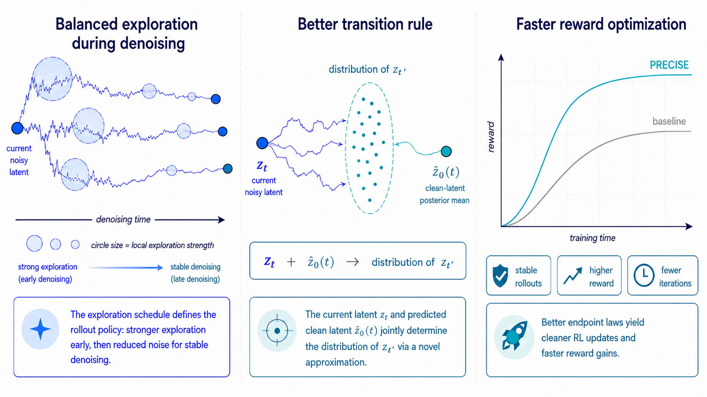
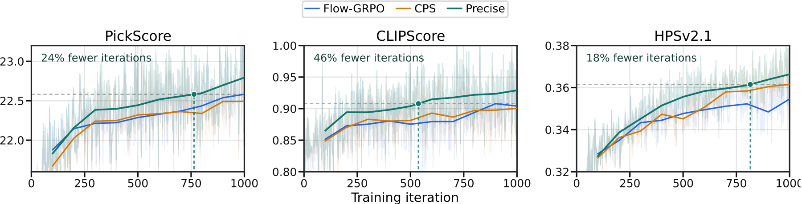

<div align="center">

<h1>Precise: SDE-Consistent Stochastic Sampling for RL Post-Training of Flow-Matching Models</h1>

<p>
<a href="https://arxiv.org/abs/2605.23522" target="_blank">
    </a>
<a href="https://totalhuang.github.io/Precise-SDE-Project-Page/" target="_blank">
    </a>
</p>

<p>
Jade Zou<sup>1,2,*,&ddagger;</sup>,
<a href="https://scholar.google.com/citations?hl=en&user=TaM4e4wAAAAJ" target="_blank">Tao Huang</a><sup>2,*,&ddagger;</sup>,
<a href="https://scholar.google.com/citations?user=gsOklKAAAAAJ&hl=zh-CN" target="_blank">Weijie Kong</a><sup>2,*</sup>,
<a href="https://scholar.google.com/citations?user=lQsMoJsAAAAJ&hl=en&oi=ao" target="_blank">Junzhe Li</a><sup>1,2</sup>,
<a href="https://scholar.google.com/citations?hl=zh-TW&user=1xTR6qoAAAAJ" target="_blank">Yue Wu</a><sup>2</sup>,
<a href="https://scholar.google.com/citations?hl=zh-TW&user=Ypu45nIAAAAJ" target="_blank">Qi Tian</a><sup>2</sup>,
<a href="https://scholar.google.com/citations?user=lHbXg_0AAAAJ&hl=zh-TW" target="_blank">Jiangfeng Xiong</a><sup>2</sup>,
<a href="https://scholar.google.com/citations?hl=zh-TW&user=nF_klRIAAAAJ" target="_blank">Jianwei Zhang</a><sup>2,&dagger;</sup>,
<a href="https://scholar.google.com/citations?user=FJwtMf0AAAAJ&hl=en" target="_blank">Liefeng Bo</a><sup>2</sup>,
<a href="https://scholar.google.com/citations?user=igtXP_kAAAAJ&hl=en" target="_blank">Zhao Zhong</a><sup>2,&sect;</sup>
</p>

<p>
<sup>1</sup>Peking University &nbsp; <sup>2</sup>Tencent Hunyuan
</p>

<p>
<sup>*</sup>Equal contribution &nbsp; <sup>&sect;</sup>Corresponding author &nbsp;
<sup>&dagger;</sup>Project leader &nbsp; <sup>&ddagger;</sup>Work done during internship at Tencent Hunyuan
</p>

</div>

## News

- Code for Precise-SDE is available in this repository, including the Precise sampler, FLUX.2 Klein training entrypoint, evaluation scripts, and reward server integrations.

## Table of Contents

- [Abstract](#abstract)
- [Training Curves](#training-curves)
- [Setup](#setup)
- [Models](#models)
- [Training](#training)
- [Evaluation](#evaluation)
- [Reward Server Setup](#reward-server-setup)
- [Acknowledgements](#acknowledgements)

## Abstract

Reinforcement learning (RL) is an effective way to improve prompt alignment and perceptual quality in diffusion and flow-matching generators. For online RL on flow-matching models, a central step is turning the deterministic sampling trajectory into a stochastic policy, usually by replacing the reverse-time ODE with an SDE. The stochastic sampler is therefore part of the policy: it controls exploration, affects denoising stability, and determines the action probabilities used by policy-gradient optimization.

We decompose stochastic sampler design into two coupled problems: choosing an exploration schedule that balances diversity and stability, and discretizing the resulting SDE faithfully at the small step counts used in RL. Existing samplers expose failure modes in this regime: Euler-style stochastic samplers can introduce excess discretization noise, while coefficient-preserving rules can bias the marginal distribution. We propose **Precise**, an SDE-consistent stochastic sampler with a logSNR-derived exploration schedule and a closed-form finite-step transition. The key approximation freezes the clean-latent posterior mean, which keeps the denoising trajectory faithful while avoiding excess noise.

Across FLUX.2 Klein experiments, Precise improves reward optimization speed and stability, reaches state-of-the-art alignment scores on in-domain rewards such as PickScore and HPSv2.1, and requires less wall-clock training time to match the best in-domain performance of prior samplers.

<p align="center">
  
</p>

## Training Curves

The main experiments compare Precise against [Dance-GRPO](https://github.com/XueZeyue/DanceGRPO), [Flow-GRPO](https://github.com/yifan123/flow_grpo), and [CPS](https://arxiv.org/abs/2509.05952) under matched training recipes. Higher is better for all plotted rewards.

### FLUX.2 Klein, 20 NFE

<p align="center">
  
</p>


## Setup

Install `uv`, then create the root environment from the repository root:

```bash
uv sync --project .
```

GPU training requires a CUDA-capable Linux environment compatible with the PyTorch and accelerator versions pinned in `pyproject.toml`.

## Models

External model and reward weights are resolved through pinned Hugging Face checkpoints unless you configure a local model mirror. Override local roots with:

```bash
export PRECISE_SDE_MODEL_ROOT=/path/to/models
```

Pinned checkpoints:

| Name | Hugging Face checkpoint | Revision |
| --- | --- | --- |
| FLUX.2 Klein | `black-forest-labs/FLUX.2-klein-base-4B` | `a3b4f4849157f664bdbc776fd7453c2783562f4d` |
| CLIP | `openai/clip-vit-large-patch14` | `32bd64288804d66eefd0ccbe215aa642df71cc41` |
| OpenCLIP ViT-H | `laion/CLIP-ViT-H-14-laion2B-s32B-b79K` | `1c2b8495b28150b8a4922ee1c8edee224c284c0c` |
| PickScore | `yuvalkirstain/PickScore_v1` | `a4e4367c6dfa7288a00c550414478f865b875800` |
| HPSv2 | `xswu/HPSv2` | `697403c78157020a1ae59d23f111aa58ced35b0a` |
| ImageReward | `zai-org/ImageReward` | `5736be03b2652728fb87788c9797b0570450ab72` |
| UnifiedReward v2 | `CodeGoat24/UnifiedReward-2.0-qwen35-9b` | `f01548b009741e12ff9817ed91dba94701ed9579` |
| GenEval Mask2Former | `tsbpp/geneval_mask2former` | `22b5a198cedf6b45e45165cf1c865d58de4a2832` |


## Training

Use the launcher rather than calling trainer scripts directly:

```bash
bash launch/train.sh --flux --reward mix --sde precise --noise-level 1.5 --step 20
```

Supported model selectors:

- `--flux`

Supported rewards:

- `mix`
- `pickscore`
- `geneval`

Supported SDE modes:

- `precise`
- `flow_grpo`
- `cps`
- `dance_grpo`
- `dance_precise`

The launcher selects the trainer, config entrypoint, and `PRECISE_SDE_LAUNCH_*` environment together. The FLUX.2 Klein config builder lives in `config/flux2_klein.py`; the shared trainer is `precise_sde/train/rl_trainer.py`.

## Evaluation

`eval/infer_eval.sh` runs through the root `uv` project and supports FLUX.2 Klein checkpoints. Pass at least one checkpoint base explicitly:

```bash
bash eval/infer_eval.sh \
  --flux \
  --ckpt-base checkpoints/logs/run-name/checkpoints \
  --eval-config '1000|precise|0|20|pickscore|{"clipscore": 1.0}'
```

Use repeated `--ckpt-base` and `--eval-config` arguments to evaluate multiple runs in one invocation.

## Reward Server Setup

Remote reward services are intentionally isolated from the main training environment when they need heavyweight or version-sensitive dependencies.

### GenEval

GenEval runs as a separate nested `uv` project:

```bash
bash precise_sde/rewards/servers/geneval/bootstrap.sh
bash precise_sde/rewards/servers/geneval/start_server.sh
uv run --project precise_sde/rewards/servers/geneval \
  python precise_sde/rewards/servers/geneval/check_server.py
```

The server binds to `127.0.0.1:18085` by default. Override the client URL with `PRECISE_SDE_GENEVAL_URL`.

### UnifiedReward

UnifiedReward v2 should run in a fresh conda environment rather than the repo root `uv` environment:

```bash
conda create -n vllm python=3.12 -y
conda activate vllm
pip install -r precise_sde/rewards/servers/unified_reward/requirements.txt
bash precise_sde/rewards/servers/unified_reward/start_server.sh
```

Probe a running server with:

```bash
uv run --project . python precise_sde/rewards/servers/unified_reward/test_api.py \
  --base-url http://127.0.0.1:8080 --tests 1,2,4
```

Point training at the server with `PRECISE_SDE_UNIFIEDREWARD_URL` or `PRECISE_SDE_UNIFIEDREWARD_URLS`. The exact request and response contract expected by training is documented in `precise_sde/rewards/servers/unified_reward/README.md`.

## Acknowledgements

This repository builds on the [Flow-GRPO](https://github.com/yifan123/flow_grpo) training codebase and compares with [Flow-GRPO](https://github.com/yifan123/flow_grpo), [Dance-GRPO](https://github.com/XueZeyue/DanceGRPO), and [CPS](https://arxiv.org/abs/2509.05952) samplers. The experiments use FLUX.2 Klein as the pretrained flow-matching backbone, and rely on community reward and evaluation models including PickScore, HPSv2.1, ImageReward, UnifiedReward v2, CLIP/OpenCLIP, and GenEval. We thank the authors and maintainers of these projects, as well as the Diffusers, Accelerate, PyTorch, and Hugging Face ecosystems that make this codebase possible.

## BibTeX

```bibtex
@misc{zou2026precisesdeconsistentstochasticsampling,
  title={Precise: SDE-Consistent Stochastic Sampling for RL Post-Training of Flow-Matching Models},
  author={Jade Zou and Tao Huang and Weijie Kong and Junzhe Li and Yue Wu and Qi Tian and Jiangfeng Xiong and Jianwei Zhang and Liefeng Bo and Zhao Zhong},
  year={2026},
  eprint={2605.23522},
  archivePrefix={arXiv},
  primaryClass={cs.LG},
  url={https://arxiv.org/abs/2605.23522},
}
```
